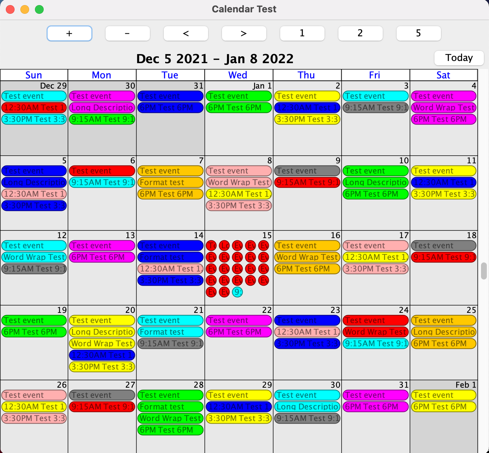

# k5n Java Calendar Tools
- Version: 1.0.1
- URL: https://github.com/craigk5n/javacaltools
- Author: Craig Knudsen, craig [< at >] k5n.us
- License: GNU GPL
- Requires: Java 17

## About
The k5n Java Calendar Tools package contains various calendar-related
libraries written in Java.  See the URL above for more information.

## Building
To build the source, you will need to use maven:
```
    maven package
```

This build process will create the following jar file:

- target/javacaltools-1.0.1.jar

# License
This library and all associated tools and applications are licensed under
the GNU Lesser General Public License v2.1.

For information about this license, see the LICENSE file.

# Swing Calendar Panel
There is a Java Swing component for display events.
You can use the `CalendarPanelTest` class to view a sample of what it looks like:
```
java -cp target/javacaltools-1.0.1.jar us/k5n/ui/calendar/CalendarPanelTest
```

This will show you something like this:

